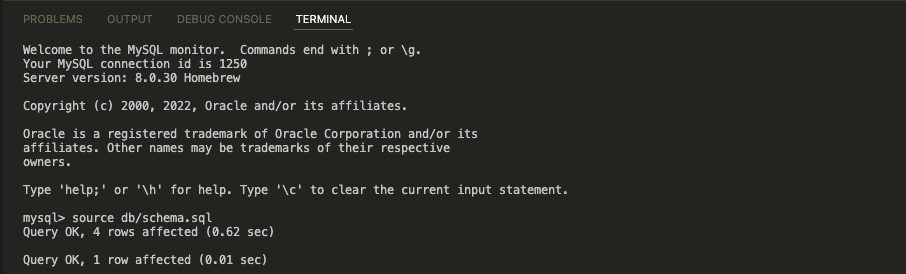
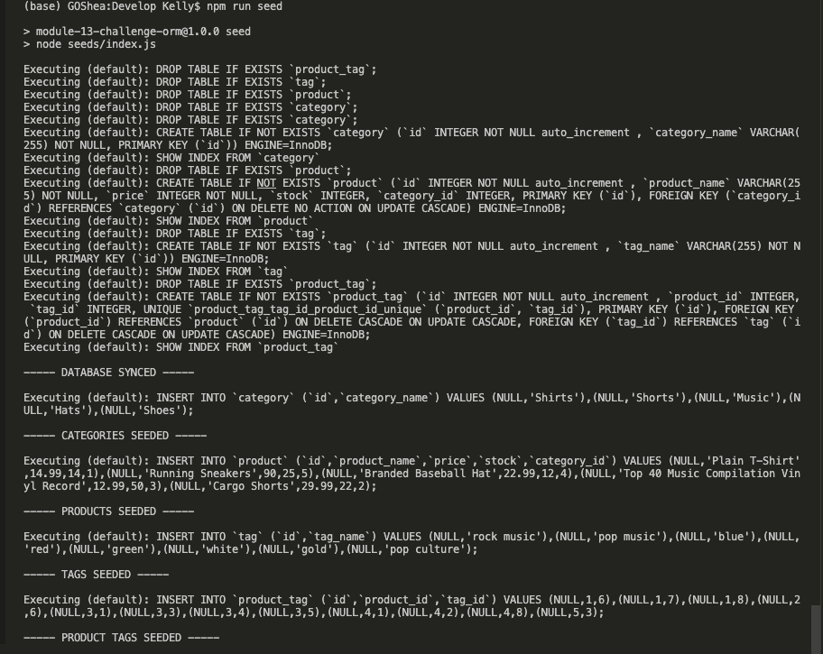

# E-commerce Back End Starter Code

## Table of Contents
- [Description] (#description)
- [Installation] (#installation)
- [Usage] (#usage)
- [Questions] (#question)

## Description
This is an application that functions as the backend for a store.  The user can store different products and categorize/tag each one.

## Installation
You must install dotenv, express, mysql2, and sequlize [npm install " "]

## Usage
The first two pictures show the set-up and seeding of the databses.

Youtube: https://youtu.be/gm-trZ60P4Y

Youtube: https://youtu.be/8O_hu1rFqb4

Youtube: https://youtu.be/GrOOeG6a2tc

Youtube: https://youtu.be/1pR7Im2HicU

## Questions
Enjoy!
Email: kelwacker@gmail.com
Github: https://github.com/kwax17